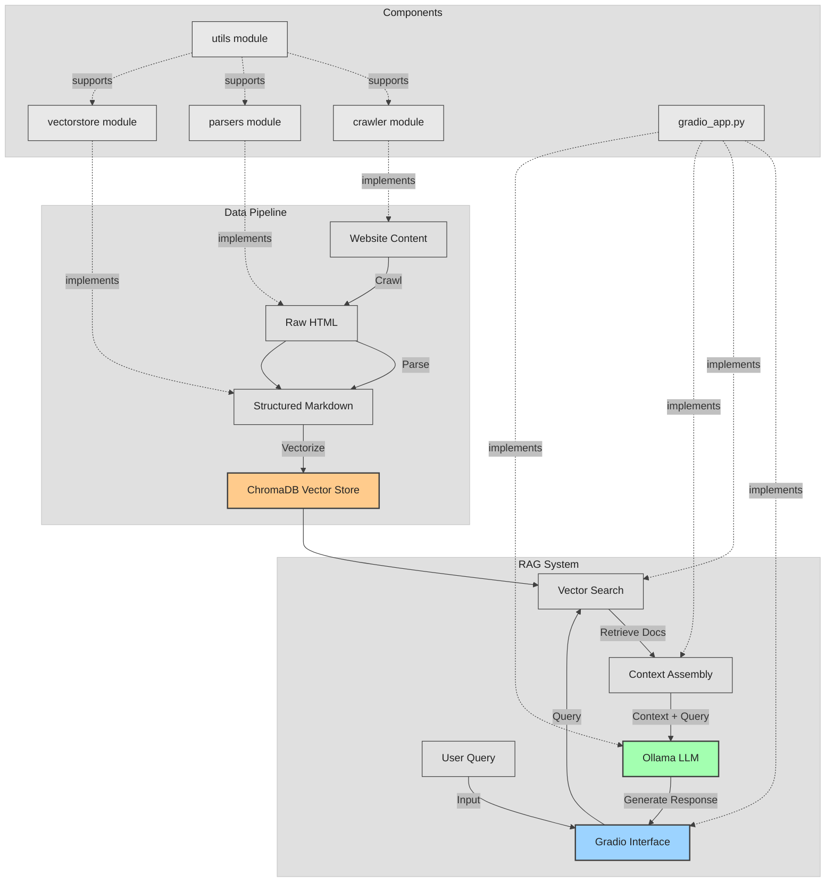

# Contributing to Tapio Assistant

Thank you for considering contributing to Tapio Assistant! This document provides guidelines and instructions for contributing to this project.

## Table of Contents
- [Contributing to Tapio Assistant](#contributing-to-tapio-assistant)
  - [Table of Contents](#table-of-contents)
  - [Technical Architecture](#technical-architecture)
  - [Development Environment Setup](#development-environment-setup)
  - [Package Management](#package-management)
  - [Code Quality](#code-quality)
    - [Ruff](#ruff)
  - [Testing Guidelines](#testing-guidelines)
    - [Running Tests](#running-tests)
    - [Code Coverage](#code-coverage)
  - [Project Structure](#project-structure)
  - [Configuration System](#configuration-system)
  - [Ollama for LLM Inference](#ollama-for-llm-inference)
  - [Pull Request Process](#pull-request-process)

## Technical Architecture

The following diagram illustrates the high-level architecture and data flow of the Tapio Assistant:



The architecture follows a pipeline design with three main components:
1. **Data Pipeline**: Responsible for crawling, parsing, and vectorizing web content
2. **RAG System**: Handles user queries, vector search, and LLM response generation
3. **Components**: The specific modules that implement the functionality

## Development Environment Setup

### Prerequisites

First, clone the repository:
```bash
git clone https://github.com/Finntegrate/migri-assistant.git
cd migri-assistant
```

### Using Dev Container (Recommended)

This project includes a preconfigured development container that provides all necessary tools and dependencies. If you're using VS Code:

1. Open the project in VS Code:
```bash
code .
```

2. VS Code will automatically detect the dev container configuration and prompt you to "Reopen in Container". Click this button to set up the development environment automatically.

The dev container includes:
- Python 3.12
- `uv` package manager
- Ollama for local LLM inference
- All required VS Code extensions (Python, Ruff, GitHub Copilot, etc.)
- Automatic dependency installation via `uv sync --dev`

### Manual Setup (Alternative)

If you prefer not to use the dev container or are using a different editor:

1. Install `uv` package manager:
```bash
curl -LsSf https://astral.sh/uv/install.sh | sh
```

2. Create and activate a virtual environment with uv:
```bash
uv venv
source .venv/bin/activate  # On Unix/macOS
# OR
.\.venv\Scripts\activate   # On Windows
```

3. Install dependencies:
```bash
uv sync --dev
```

4. Install Ollama for local LLM inference:
   - Follow the installation instructions at [ollama.ai](https://ollama.ai)

### Installing Required Models

Regardless of which setup method you chose, you'll need to install the required Ollama models for LLM text generation:

```bash
ollama pull llama3.2
```

**Note on Model Sizes**: Some Ollama models can be quite large (several GB) and may require significant computational resources. If you have limited disk space or computational power, consider experimenting with smaller parameter versions of models:

- `llama3.2:1b` - Lightweight 1 billion parameter version
- `llama3.2:3b` - Medium 3 billion parameter version
- `deepseek-r1:1.5b` - Efficient reasoning model
- `gemma3:1b` - Google's compact model
- `qwen3:1.7b` - Alibaba's efficient model

You can install any of these alternatives with:
```bash
ollama pull <model-name>
```

You can verify the model is installed by listing available models:

```bash
ollama list
```

**Embedding Models**: The vectorization process uses sentence-transformers models for generating embeddings (default: `all-MiniLM-L6-v2`). These models are automatically downloaded by the HuggingFace library when first used, so no manual installation is required.

*Note: While Ollama also provides embedding models (like `all-minilm`), the current implementation uses HuggingFace sentence-transformers models. If you've installed Ollama embedding models, they won't be used by the current vectorization process unless the code is modified to use Ollama embeddings instead.*

## Package Management

We use the `uv` package manager for this project. To add packages:

```bash
uv add <package-name>
```

Do not use `pip`, `uv pip install`, or `uv pip install -e .` to install packages or this project.

To synchronize dependencies from the lockfile:

```bash
uv sync
```

## Code Quality

### Ruff

We use [Ruff](https://docs.astral.sh/ruff/) for linting and formatting. Please ensure your code passes all checks before submitting a pull request.

You can run the linter with the following command:

```bash
uv run ruff check .
```

You can also run the linter with the `--fix` option to automatically fix some issues:

```bash
uv run ruff check . --fix
```


## Testing Guidelines

### Running Tests

When adding features, always include appropriate tests. Run the entire test suite with:

```bash
uv run pytest
```

### Code Coverage

We aim for high test coverage. When submitting code:

1. Check your coverage with:

```bash
uv run pytest --cov=tapio
```

2. Generate HTML coverage reports for visual inspection:

```bash
uv run pytest --cov=tapio --cov-report=html
```

3. For specific module coverage:

```bash
uv run pytest --cov=tapio.utils tests/utils/
```

Aim for at least 80% coverage for new code. The HTML coverage report can be found in the `htmlcov` directory. Open `htmlcov/index.html` in your browser to view it.

## Project Structure

The project has been designed with a clear separation of concerns:

- `crawler/`: Module responsible for crawling websites and saving HTML content
- `parsers/`: Module responsible for parsing HTML content into structured formats
- `vectorstore/`: Module responsible for vectorizing content and storing in ChromaDB
- `config/`: Configuration settings for the project
- `gradio_app.py`: Gradio interface for the RAG chatbot
- `utils/`: Utility modules for embedding generation, markdown processing, etc.
- `tests/`: Test suite for all modules

## Configuration System

The application uses a centralized configuration system:

- `config/settings.py`: Contains global configuration settings used across different components
- `config/site_configs.yaml`: Site-specific parser configurations
- `config/config_models.py`: Pydantic models for configuration
- `config/config_manager.py`: Central manager for accessing configurations

When adding new features that require configuration values:

1. Use existing settings from `DEFAULT_DIRS` when possible
2. For new configuration needs, add them to the appropriate config file
3. Avoid hardcoding values that might need to change in the future
4. Use descriptive keys for configuration values

## Ollama for LLM Inference

We use Ollama for local LLM inference.

The following Ollama models are used in the project:
- `llama3.2`: The base model for text generation.

To query the Ollama models that are installed, use the command:

```bash
ollama list
```

To list all Ollama commands, use the command:

```bash
ollama help
```

To get help for a specific command, use the command:

```bash
ollama <command> --help
```

Ensure you have the required models installed:

```bash
ollama pull llama3.2
```

## Pull Request Process

1. Ensure any install or build dependencies are removed before the end of the layer when doing a build.
2. Update the README.md with details of changes to the interface, if appropriate.
3. Make sure all tests pass and code is properly formatted with Ruff.
4. Check that code coverage meets our standards (minimum 80%).
5. Submit your pull request with a clear description of the changes, related issue numbers, and any special considerations.
6. The pull request will be merged once it receives approval from the maintainers.
